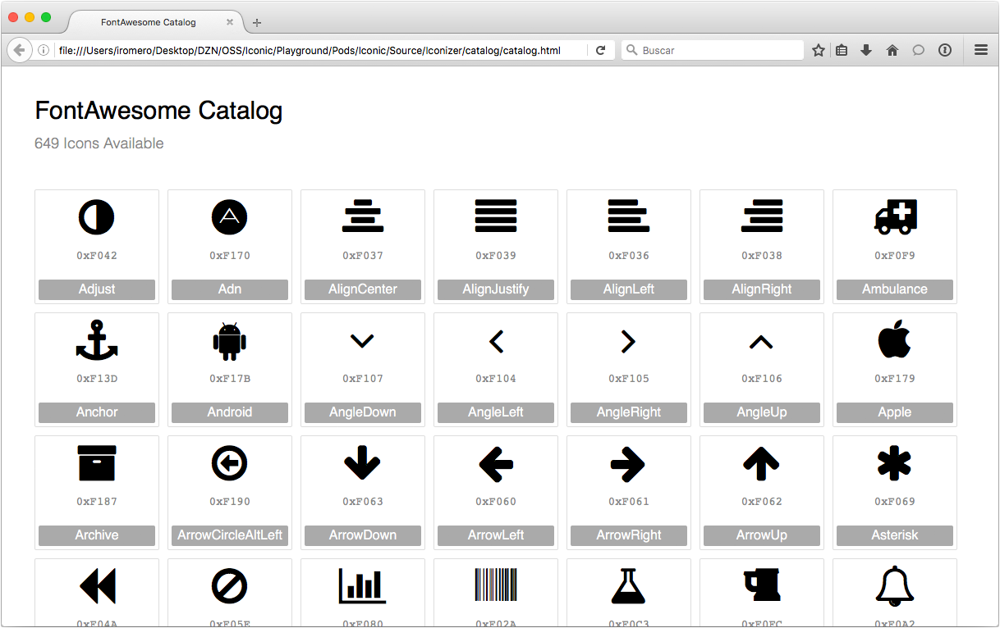

[](https://travis-ci.org/home-assistant/Iconic/builds)
[](https://codecov.io/gh/home-assistant/Iconic)
[](http://cocoadocs.org/docsets/Iconic/)
[](https://cocoapods.org/pods/Iconic)
[]()
[](https://opensource.org/licenses/Apache-2.0)


**Iconic** helps making icon fonts integration effortless on iOS, tvOS and watchOS. Its main component is in charge of auto-generating strongly typed Swift code with [SwiftGen](https://github.com/SwiftGen/SwiftGen), compatible with Objective-C.

You will interact with an auto-generated class under the name of `{FontName}Icon.swift`, which is a light abstraction of the `IconDrawable.swift` protocol. For more information, have a look at [how to install](#installation) and [how to use](#how-to-use).

Give **Iconic** a test drive by simply doing `pod try Iconic` in your terminal, and pick the `Samples.xcworkspace`.

<p align="center">

</p>


## Why Icon Fonts?
- Resolution independent: scale and tint without quality loss
- Automatically scaled for different screen densities
- Work with (way) less image files
- Improve visual consistency
- Platform agnostic
- Add better UI accessibility
- Simple to work with

#### Where can I find awesome icon fonts?
- Check out the [icon fonts available in this repo](./Fonts)!
- There are many [open sourced icon fonts](http://fontello.com/) out there (most are available under the [SIL Open Font License](http://scripts.sil.org/OFL)). They are designed for the web but they are still very useful for iOS.
- You can ask your nearest friendly designer! Making an icon font isn't that hard, specially if you already have the vector assets.
- You can [read this article](http://rafaltomal.com/how-to-create-and-use-your-own-icon-fonts/) and give [fontastic.me](http://fontastic.me/) a shot.


## Key Features
- [Easy installation over CocoaPods](#installation)
- Auto-generated enums and unicodes mapping, out of the font's [PUA range](https://en.wikipedia.org/wiki/Private_Use_Areas)
- `NSAttributedString` and `UIImage` outputs
- Supports TTF and OTF font files
- Fonts are included and registered dynamically
- [Interface Builder support](#interface-builder-support) (iOS & tvOS only)
- [UIKit extensions](#uikit-extensions) for `UIBarButtonItem`, `UITabBarItem` and `UIButton` (iOS & tvOS only)
- Auto-generated [icon font html catalog](#icon-font-catalog)
- Compatible with Swift 3.0 and Objective-C
- iOS 8 or later
- tvOS 9 or later
- [watchOS 2 or later](#about-watchos-support)

_Note: Some open sourced icon fonts don't include the names of each of their glyphs. This could result in a non-descriptive enums, which can make things less intuitive for you when using Iconic. If you create your own icon font, make sure to properly name each glyph._


## Installation

#### Via CocoaPods

Start by defining **Iconic** on your Podfile. Because we use an environment variable on a non-traditional setup, you will need to do it the following way:
```ruby
pod 'Iconic', :git => 'https://github.com/home-assistant/Iconic.git', :tag => '1.3'
```

To install **Iconic** with a custom icon font, you need to use the `FONT_PATH` environment variable:
```ruby
FONT_PATH='/Users/WillFerrell/Desktop/super-duper-font.otf' pod install

FONT_PATH='/Users/WillFerrell/Desktop/super-duper-font.otf' pod update Iconic
```

If you simply call `pod install`, **Iconic** will be installed using its default font, [FontAwesome](https://github.com/FortAwesome/Font-Awesome).

After the installation is complete, you should see 3 files: `IconDrawable.swift`, the auto-generated `{FontName}Icon.swift` and the font file added as a resource:


## How to use
For complete documentation, [visit Iconic's docs](http://cocoadocs.org/docsets/Iconic/).

### Import
Import the Iconic module:
<details open>
<summary>Swift</summary>

```swift
import Iconic
```
</details>
<details>
<summary>Objective-C</summary>

```objc
@import Iconic;
```
</details>


### Registering the icon font
Registration is required to activate Iconic. You shall do this once, when launching your application. Internally, the icon mapping is retrieved and kept in memory during the application's life term.

Iconic provides a convenient way to register the icon font:
Note: the method name may change depending of your icon font's name:
<details open>
<summary>Swift</summary>

```swift
FontAwesomeIcon.register()
```
</details>
<details>
<summary>Objective-C</summary>

```objc
[Iconic registerFontAwesomeIcon];
```
</details>

## Use as images
You can construct an `UIImage` instance out of a font's icon and tint it. This may be very convenient for integrating with existing UIKit controls which expect `UIImage` objects already.

Images are created using NSStringDraw APIs to render a `UIImage` out of an `NSAttributedString`.
<details open>
<summary>Swift</summary>

```swift
let size = CGSize(width: 20, height: 20)

let icon = FontAwesomeIcon.HomeIcon
let image = icon.image(ofSize: size, color: .blue)
```
</details>
<details>
<summary>Objective-C</summary>

```objc
[Iconic imageWithIcon:FontAwesomeIconHomeIcon size:CGSizeMake(20, 20) color:[UIColor blueColor]];
```
</details>

### Use as attributed strings
You may need to icons as text too, and simplify your layout work.
For example, instead of having an image and a label, you can combined it all in one single label:
<details open>
<summary>Swift</summary>

```swift
let icon = FontAwesomeIcon.HomeIcon
let iconString = icon.attributedString(ofSize: 20, color: .blue)
```
</details>
<details>
<summary>Objective-C</summary>

```objc
[Iconic attributedStringWithIcon:FontAwesomeIconHomeIcon pointSize:20.0 color:[UIColor blueColor]];
```
</details>

### Use as unicode string
Ultimately, you may need to retrieve the unicode string representation on an icon to do more advanced things:
<details open>
<summary>Swift</summary>

```swift
let unicode = FontAwesomeIcon.HomeIcon.unicode
```
</details>

### Use as font
For further customization, you may need to use the UIFont object instead:
<details open>
<summary>Swift</summary>

```swift
let font = FontAwesomeIcon.font(ofSize: 20)
```
</details>
<details>
<summary>Objective-C</summary>

```objc
UIFont *font = [Iconic fontAwesomeIconFontOfSize:20.0];
```
</details>


### Interface Builder Support


Iconic includes a `UIImageView` subclass under the name of `{FontName}IconView.swift`, conforming to `@IBInspectable`. This class allows IB integration with little effort:
- Use the `iconName` attribute to set the icon on Interface Builder (use the [icon font html catalog](#icon-font-catalog) as reference for icon names).
- Adjust the bounds of the view to see it dynamically adjust the icon size.


### UIKit Extensions
UIKit extensions are also included, just to make your code look simpler:
<details open>
<summary>Swift</summary>

```swift
// UITarbBarItem
UITabBarItem(withIcon: .BookIcon, size: CGSize(width: 20, height: 20), title: "Catalog")

// UIBarButtonItem
UIBarButtonItem(withIcon: .BookIcon, size: CGSize(width: 24, height: 24), target: self, action: #selector(didTapButton))

// UIButton
let button = UIButton(type: .System)
button.setIconImage(icon: .HeartIcon, size: CGSize(width: 44, height: 44), color: nil, forState: .Normal)
```
</details>
<details>
<summary>Objective-C</summary>

```objc
// UITarbBarItem
[[UITabBarItem alloc] initWithIcon:FontAwesomeIconBookIcon size:CGSizeMake(20.0, 20.0) title:@"Catalog"];

// UIBarButtonItem
[[UIBarButtonItem alloc] initWithIcon:FontAwesomeIconCogIcon size:CGSizeMake(24.0, 24.0) target:self action:@selector(didTapButton)];

// UIButton
UIButton *button = [UIButton buttonWithType:UIButtonTypeSystem];
[button setIconImageWithIcon:FontAwesomeIconHeartIcon size:CGSizeMake(44.0, 44.0) color:nil forState:UIControlStateNormal];
```
</details>


## Sample Project
Check out the sample project, everything is demo'd there.


Give Iconic a test drive by simply doing `pod try Iconic` in your terminal, and pick the `Samples.xcworkspace`.

On the sample project, Iconic is installed as a development pod. Because of this, pod files are not versioned. Therefore, if you clone the repo manually, you will to install the pods yourself.

#### About watchOS support:
When running the watchOS example, you might get a "No such module CoreText" error. This is because the CoreText.framework is missing for the watchOS Simulator. Run the 'WatchSimulator-CoreText-Patch.sh' script located in this repository, to copy the CoreText header files from the WatchOS SDK. You will then be able to run the watchOS sample with no issues as well as running Iconic on your Watch apps in the simulator.

## Icon Font Catalog
Besides the auto-generated Swift code, an icon font catalog will be added in `Pods/Iconic/Source/Catalog`. Use this as a visual reference about the icons and their names.



_Note: if you are using Chrome as your default browser, you will need to restart it using the `open -a 'Google Chrome' --args -allow-file-access-from-files` in the command line to be able to open view the catalog. This is because the html's javascript loads a local json file and Chrome has built-in security features to disable it. You can also use any other web browser like Safari or Firefox to open the catalog html._


## Icon Font Samples
This repository also [includes a few open source and free icon fonts](./Fonts) for you to try Iconic with:
* [FontAwesome](https://github.com/FortAwesome/Font-Awesome) by *Dave Gandy*
* [Dripicons](https://github.com/amitjakhu/dripicons) by *Amit Jakhu*
* [open-iconic](https://github.com/iconic/open-iconic) by *Waybury*
* [MaterialIcons](https://github.com/google/material-design-icons) by *Google*
* [Linearicons](https://linearicons.com/) by *Perxis*


## License
This library is licensed under the [Apache 2.0](LICENSE.md).

SwiftGen is licensed under the [MIT License](https://github.com/SwiftGen/SwiftGen/blob/master/LICENCE).

The Font Awesome font is licensed under the [SIL OFL 1.1 License](http://scripts.sil.org/OFL)
